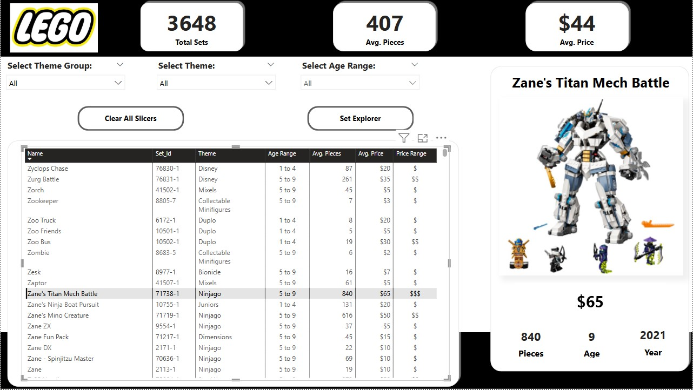
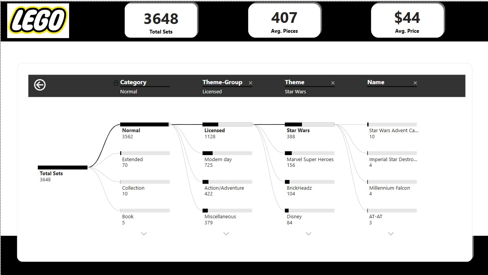

# 
📊 Interactive LEGO Report.

## 🚀 Project Overview:
This project presents an **interactive LEGO report** designed using **Power BI**, catering to avid LEGO collectors who seek the perfect next set. By leveraging **advanced data visualization and reporting tools**, users can explore a dataset of over **4,000 LEGO sets** based on key attributes such as **theme, piece count, age range, and price**.  

## 🎯 Key Features:
✔ **Dynamic Filtering:** Users can filter LEGO sets based on theme, price, and age range.  
✔ **Custom Visualizations:** Interactive charts, decomposition trees, and numeric range parameters enhance data exploration.  
✔ **Custom Image Tooltips:** Hover-over visuals display additional insights.  
✔ **Bookmark Actions & Page Navigation:** Seamless transitions between report sections for an intuitive experience.  

## 🛠️ Tools & Technologies: 
- **Power BI** – For data visualization and interactive reporting.
- **DAX (Data Analysis Expressions)** – To create calculated fields and measures.  
- **Data Transformation** – Cleaning and structuring LEGO set data for optimal insights.  

## 📸 Dashboard Snapshots:
### Main Dashboard View
  
 
### Set Explorer View

## 🎓 Learning Outcomes  
By working on this project, I gained hands-on experience in:  
🔹 Creating **interactive reports** with **Power BI**. 
🔹 Using **advanced visualization techniques**.  
🔹 Implementing **customized tooltips and navigation actions**.  
🔹 Enhancing user experience with **dynamic slicers & decomposition trees**.  

*📌This project is a **step-by-step Power BI report development walkthrough**, inspired by **Maven Analytics Founder Chris Dutton’s** youtube video.*

